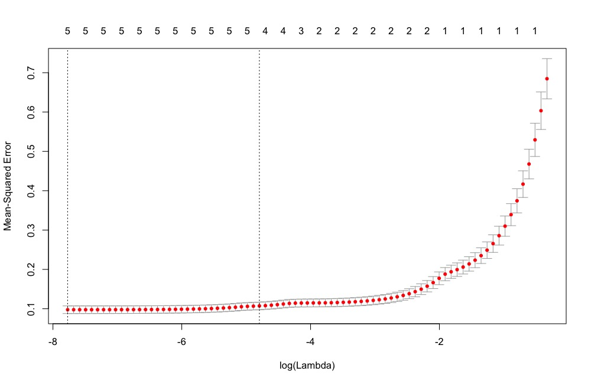
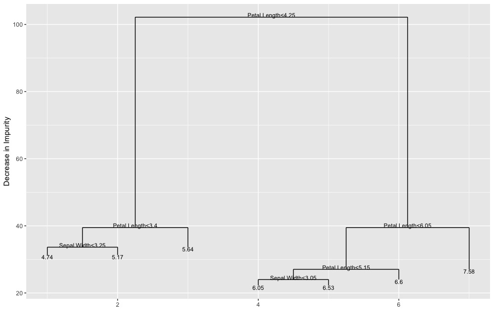

# ggDiagnose

This package is geared towards data scientists, statistics students and the broader statistics community who increasingly use `ggplot2` and `tidyverse` tools to explore and visualize their data. In this package we provide functions that create `ggplot2` based visualizations that can replace the base `plot` function to diagnose and visualize `R` objects. Specifically, this package aims to provide visualation tools when these objects are model objects and other non-traditional (read: non-`data frame`) based objects.

*For examples of visuals see the [example section](#examples).*

## Structure

`ggDiagnose` consists of 3 major functions; `ggDiagnose`, `ggVis` and `dfCompile`.

The first 2, `ggDiagnose` and `ggVis` provide `ggplot2` graphics similar to what the base `plot` function would provide for the specific `R` objects. `ggDiagnose` does so for statistical model objects and `ggVis` does so for other objects.

`dfCompile` provides the user with a data frame that could be used to create the `ggDiagnose` and/or `ggVis` graphics for that specific object (or at least the vast majority of the graphic/graphics). This function is similar to `broom`'s `augment` and `tidy` functions.

## Philosophy

This package was developed to encourage more students (and Professors teaching `R`) to work within the `tidyverse` / `ggplot2` paradigm when learning Statistical Machine Learning tools. Additionally, it quickly became a focus to also tailor this package to data scientists, providing quick and quality `ggplot2` versions of diagnostic graphics for presentations and aid in data scientists work flow.

We include `dfCompile`, which is similar to `broom`'s `augment` and `tidy` functions to assist students and data scientists in building graphics to their liking (either from the ground-up or updating provided graphics) by providing the data frames that created the associated `ggDiagnose` and `ggVis` graphics. In addition, we hope that access to this "raw" data would encourage students to develop a better understanding of what is going underneath the hood (in terms of `tidyverse` and `gglot2` paradigms).

# Installation

To install this function, just do the following:

```r
library(devtools)
devtools::install_github("benjaminleroy/ggDiagnose")
```

This package **requires** very few packages; if dependencies are required for a specific object's functions, the user is prompted to install such packages.

# Future of the Package

This package was envisioned as a package that would naturally grow to meet the needs of the users. As such, please (1) feel free to create an issue to request `ggDiagnose`/`ggVis` functionality for `R` objects and (2) develop these missing modules and submit a merge request to improve the package.


# Examples

Links to examples:

**`ggDiagnose`**

+ [`ggDiagnose.lm`](#ggdiagnoselm)
+ [`ggDiagnose.glmnet`](#ggdiagnoseglmnet)
+ [`ggDiagnose.cv.glmnet`](#ggdiagnosecvglmnet)
+ [`ggDiagnose.Gam`](#ggdiagnosegam)
+ [`ggDiagnose.tree`](#ggdiagnosetree)
+ ... more to come ... 

**dfCompile**

+ [`dfCompile.lm`](#dfcompilelm)
+ [`dfCompile.glmnet`](#dfcompileglmnet)
+ [`dfCompile.cv.glmnet`](#dfcompilecvglmnet)
+ [`dfCompile.Gam`](#dfcompilegam)
+ [`dfCompile.tree`](#dfcompiletree)
+ ... more to come ... 

## `ggDiagnose`

### `ggDiagnose.lm` 

This example is for an `lm` object, function works for `glm` and `rlm` objects as well.

```r
lm.object <- lm(Sepal.Length ~., data = iris)
```


The original visualization:

```r
par(mfrow = c(2,3))
plot(lm.object, which = 1:6)
```


The updated visualization:

```r
ggDiagnose(lm.object, which = 1:6)
```


`ggDiagnose.lm` allows for similar parameter inputs as `plot.lm` but also includes additional ones. This may changes as the package evolves. 

### `ggDiagnose.glmnet`

```r
library(glmnet)
glmnet.object <- cv.glmnet(y = iris$Sepal.Length, 
                           x = model.matrix(Sepal.Length~., data = iris))
```

The original visualization:

```r
plot(glmnet.object)
```


The updated visualization:

```r
ggDiagnose(glmnet.object)
```


### `ggDiagnose.cv.glmnet`

```r
cv.glmnet.object <- cv.glmnet(y = iris$Sepal.Length, 
                              x = model.matrix(Sepal.Length~., data = iris))
```

The original visualization:

```r
plot(cv.glmnet.object)
```


The updated visualization:

```r
ggDiagnose(cv.glmnet.object)
```


## ggDiagnose.Gam

```r
library(gam)
gam.object <- gam::gam(Sepal.Length ~ gam::s(Sepal.Width) + Species,
                  data = iris)
```

The original visualization:

```r
par(mfrow = c(1,2))
plot(gam.object, se = TRUE, residuals = TRUE)
```


The updated visualization:


```r
ggDiagnose(gam.object, residuals = TRUE) # se = TRUE by default

```


## ggDiagnose.tree

Note, for more perfect replication of the base `plot` function add `+ ggdendro::theme_dendro()` which drops all ggplot background elements.

```r
library(tree)

tree.object <- tree(Sepal.Length ~., data = iris)
```

The original visualization:

```r
plot(tree.object)
```


The updated visualization (followed by quick improvement):

```r
ggDiagnose(tree.object, split.labels = FALSE)
```


```r
ggDiagnose(tree.object, split.labels = TRUE,
           leaf.labels = TRUE)
```



## `dfCompile`

### `dfCompile.lm`

```r
> lm.object <- lm(Sepal.Length ~., data = iris)
```

```r
> dfCompile(lm.object) %>% names
 [1] "Sepal.Length"          "Sepal.Width"           "Petal.Length"         
 [4] "Petal.Width"           "Species"               ".index"               
 [7] ".labels.id"            ".weights"              ".yhat"                
[10] ".resid"                ".leverage"             ".cooksd"              
[13] ".weighted.resid"       ".std.resid"            ".sqrt.abs.resid"      
[16] ".pearson.resid"        ".std.pearson.resid"    ".logit.leverage"      
[19] ".ordering.resid"       ".ordering.std.resid"   ".ordering.cooks"      
[22] ".non.extreme.leverage"
```

```r
> dfCompile(lm.object) %>% head(2)
  Sepal.Length Sepal.Width Petal.Length Petal.Width Species .index .labels.id
1          5.1         3.5          1.4         0.2  setosa      1          1
2          4.9         3.0          1.4         0.2  setosa      2          2
  .weights    .yhat     .resid  .leverage      .cooksd .weighted.resid
1        1 5.004788 0.09521198 0.02131150 0.0003570856      0.09521198
2        1 4.756844 0.14315645 0.03230694 0.0012517183      0.14315645
  .std.resid .sqrt.abs.resid .pearson.resid .std.pearson.resid .logit.leverage
1  0.3136729       0.5600651     0.09521198          0.3136729      0.02177557
2  0.4742964       0.6886918     0.14315645          0.4742964      0.03338553
  .ordering.resid .ordering.std.resid .ordering.cooks .non.extreme.leverage
1             115                 115             124                  TRUE
2              98                  98              96                  TRUE
```

### `dfCompile.glmnet`

```r
> library(glmnet)
> glmnet.object <- glmnet(y = iris$Sepal.Length,
                 x = model.matrix(Sepal.Length~., data = iris))
```

```r
> dfCompile(glmnet.object) %>% names
[1] ".log.lambda"      "variable"         "beta.value"       ".norm"           
[5] ".dev"             ".number.non.zero"
```

```r
> dfCompile(glmnet.object) %>% head(2)
  .log.lambda     variable beta.value      .norm      .dev .number.non.zero
1  -0.3292550 X.Intercept.          0 0.00000000 0.0000000                0
2  -0.4222888 X.Intercept.          0 0.03632753 0.1290269                1
```

### `dfCompile.cv.glmnet`

```r
> library(glmnet)
> cv.glmnet.object <- cv.glmnet(y = iris$Sepal.Length,
                                x = model.matrix(Sepal.Length~., data = iris))
```

```r
> dfCompile(cv.glmnet.object) %>% names
[1] "cross.validated.error"        "cross.validation.upper.error"
[3] "cross.validation.lower.error" "number.non.zero"             
[5] ".log.lambda"
```

```r
> dfCompile(cv.glmnet.object) %>% head(2)
   cross.validated.error cross.validation.upper.error
s0             0.6840064                    0.7340895
s1             0.6009296                    0.6487392
   cross.validation.lower.error number.non.zero .log.lambda
s0                    0.6339234               0  -0.3292550
s1                    0.5531200               1  -0.4222888
```

### `dfCompile.Gam`

```r
> library(gam)
> gam.object <- gam::gam(Sepal.Length ~ gam::s(Sepal.Width) + Species,
                         data = iris)
```

```r
> dfCompile(gam.object) %>% names
 [1] "Sepal.Length"                       
 [2] "Sepal.Width"                        
 [3] "Petal.Length"                       
 [4] "Petal.Width"                        
 [5] "Species"                            
 [6] ".resid"                             
 [7] ".smooth.gam.s.Sepal.Width."         
 [8] ".smooth.Species"                    
 [9] ".se.smooth.gam.s.Sepal.Width..upper"
[10] ".se.smooth.Species.upper"           
[11] ".se.smooth.gam.s.Sepal.Width..lower"
[12] ".se.smooth.Species.lower"  
```

```r
> dfCompile(gam.object) %>% head(2)
  Sepal.Length Sepal.Width Petal.Length Petal.Width Species     .resid
1          5.1         3.5          1.4         0.2  setosa 0.03614362
2          4.9         3.0          1.4         0.2  setosa 0.23792407
  .smooth.gam.s.Sepal.Width. .smooth.Species
1                 0.35570963       -1.135187
2                -0.04607082       -1.135187
  .se.smooth.gam.s.Sepal.Width..upper .se.smooth.Species.upper
1                          0.44985507                -1.006952
2                         -0.03387729                -1.006952
  .se.smooth.gam.s.Sepal.Width..lower .se.smooth.Species.lower
1                          0.26156418                -1.263422
2                         -0.05826436                -1.263422
```

### `dfCompile.tree`

```r
> library(gam)
> gam.object <- gam::gam(Sepal.Length ~ gam::s(Sepal.Width) + Species,
                         data = iris)
```

```r
> dfCompile(tree.object) %>% length
[1] 4

> dfCompile(tree.object)$segments %>% head
     .x       .y .xend     .yend .n
2 2.250 39.49191 2.250 102.16833 73
3 1.500 33.64903 1.500  39.49191 53
4 1.000 31.29592 1.000  33.64903 20
5 2.000 31.29592 2.000  33.64903 33
6 3.000 33.64903 3.000  39.49191 20
7 6.125 39.49191 6.125 102.16833 77

> dfCompile(tree.object)$labels %>% head
      .x        .y            .label
1 4.1875 102.16833 Petal.Length<4.25
2 2.2500  39.49191  Petal.Length<3.4
3 1.5000  33.64903  Sepal.Width<3.25
4 6.1250  39.49191 Petal.Length<6.05
5 5.2500  27.04709 Petal.Length<5.15
6 4.5000  24.00201  Sepal.Width<3.05

> dfCompile(tree.object)$leaf_labels %>% head
   .x       .y .label    .yval
4   1 31.29592   4.74 4.735000
5   2 31.29592   5.17 5.169697
6   3 33.64903   5.64 5.640000
10  4 22.26715   6.05 6.054545
11  5 22.26715   6.53 6.530000
12  6 24.00201   6.60 6.604000
```

# TODO:

Overarching (when making new object functionality):

- [ ] 1. check what `broom` does for each object. Document when `broom` doesn't create what we need for the visualizations.

`ggDiagnose` (models):

- [x] 1. `lm`, `glm` (from `stats` package): `ggDiagnose.lm`
- [x] 2. `Gam` (from the original `gam` package - not `mgcv` - or at least not first round) 
- [x] 3. `glmnet` (from `glmnet` packages): `ggDiagnose.glmnet`, `ggDiagnose.cv.glmnet`
    - [ ] `plot.mrelnet`, `plot.multnet needed`?
- [x] 4. `tree` (from `tree` package - could also one from `rpart` package - use `ggdendro` and [see examples from `ggdendro`](https://cran.r-project.org/web/packages/ggdendro/vignettes/ggdendro.html).
- [ ] 5. `randomForest`
- [ ] 6. `mclust` (multiple objects - multiple options for `Mclust` graphic. - will take time)
- [ ] 7. PCA/factor analysis, etc objects
- [ ] 8. look at CMU 402 for more packages

`ggVis` (other objects):

- [ ] 1. `sp`
- [ ] 2. `dendrogram`
- [ ] 3. `matrix` (for `heatmap`? or `image`?) - let's do both for now.

packages that I'm not sure can be done:
- [ ] 1. `lme4` (these objects don't seem to have `plot._` functions to emulate.)
- [ ] 2. `kde2d` - from MASS (actually just produces a list ...) - but `z` could be dealt with a matrix that you want to do "image" to.
- [ ] 9. `ranger` (better RF package?) (doesn't actually have `plot` function for ranger objects...)

teaching:

- [ ] 1. In examples for each function provide code to create some / all of the plots in a more basic manner with straight use of `tidyverse`. (Is this worthwhile? maybe for non-trivial/non standard `ggplot2` graphics?)

best coding practices:

- [ ] 1. decide which parameters are passed to the visualization functions and how they differ / are the same of the `plot` implementation. For all visuals we have `show.plot` and `return` parameters.

 documentation:

- [ ] 1. create a new file for package documentation. See: http://r-pkgs.had.co.nz/man.html#man-packages

## things to look into:

S3 methods? - should the whole thing be a S3 method?

Write a blog post about putting a changing axis on top, link to the one where they transform the equation. Mention Hadley's thoughts on the matter.

## ideas for tests:

1. for all check the data frame coming out of `ggDiagnose` vs `dfCompile`, 
2. look at the names of the data frame returned by `dfCompile`
3. check return options for `ggDiagnose`


## readme needs:

Probably should be showcasing `dfCompile` as well... how to do so in `.md`...
