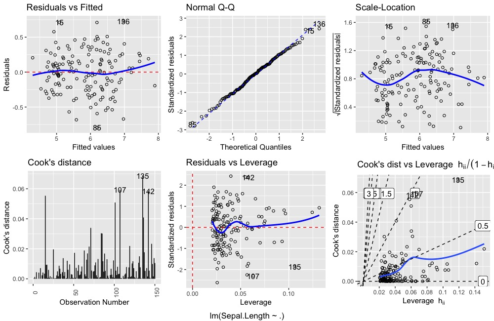
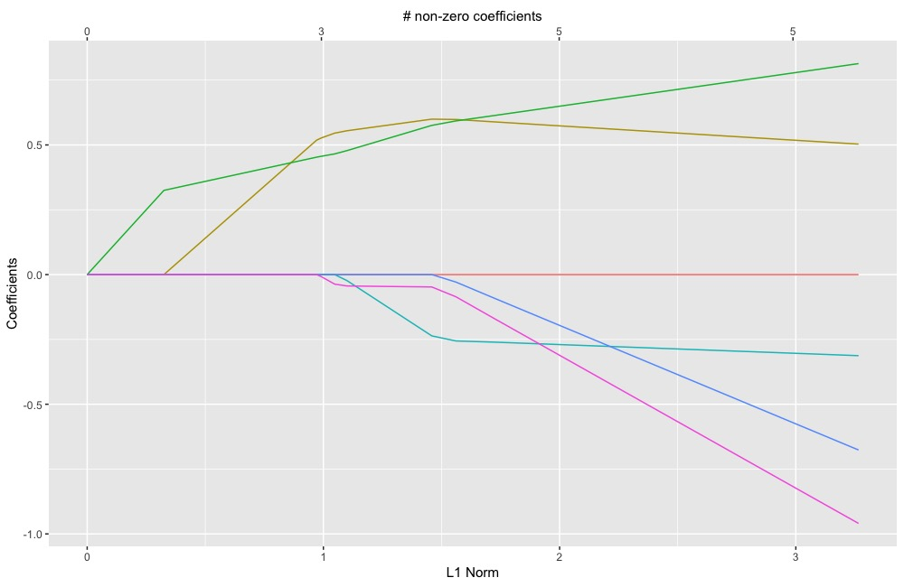

# ggDiagnose

This package is geared towards Data Scientists, Students and the broader Statistics Coummunity who increasingly use `ggplot` and `tidyverse` tools to explore and visualize their data. In this package we provide functions that create `ggplot` based visualizations that can replace the base `plot` function to diagnose and visualize `R` objects.

*For examples of visuals see the [example section](#examples).*

## Structure

`ggDiagnose` consists of 3 major functions; `ggDiagnose`, `ggVis` and `dfCompile`.

The first 2, `ggDiagnose` and `ggVis` proivde `ggplot` graphics similar to what the base `plot` function would provide for the specific `R` objects. `ggDiagnose` does so for statistical model objects and `ggVis` does so for other objects.

`dfCompile` provides the user with a data frame that could be used to create the `ggDiagnose` and/or `ggVis` graphics for that specific object (or at least the vast majority of the graphic/graphics). This function is similar to `broom`'s `augment` and `tidy` functions.

## Philosophy

This package was developed to encourage more students (and Professor's teaching `R`) to work with `tidyverse` / `ggplot2` paradigm when learning Statistical Machine Learning tools. Additionally, it quickly became a focus to also tailor this package to data scientists, providing quick and quality `ggplot2` versions of diagnostic graphics for presentations and data scientists work flow.

We include `dfCompile`, which is similar to `broom`'s `augment` and `tidy` functions to assist students and data scientistis in building graphics to their linking (either from the ground-up or updating provided graphics). In addition we hope that access to the "raw" data would encourage students to get a better understanding of what is going underneath the hood (in terms of `tidyverse` and `gglot2` paradigms).

# Installation

To install this function, just do the following:

```{r}
library(devtools)
devtools::install_github("benjaminleroy/ggDiagnose")
```

This package **requires** very few packages; if depndencies are required for a specific object's functions, the user is prompted to install such packages.

# Future of the Package

This package was envisioned as a package that would naturally grow to meet the needs of the users. As such, please (1) feel free to create an issue to request `ggDiagnose`/`ggVis` functionality for `R` objects and (2) develop these missing modules and submit a merge request to improve the package.


# TODO:

Overarching (when making new object functionality):

- [ ] 1. check what broom does for each object. Document when broom doesn't create what we need for the visualizations.

`ggDiagnose` (models):

- [x] 1. lm, glm (from `stats` package): `ggDiagnose.lm`
- [x] 2. Gam (from the original `gam` package - not `mgcv` - or at least not first round) 
- [x] 3. glmnet (from `glmnet` packages): `ggDiagnose.glmnet`, `ggDiagnose.cv.glmnet`
    - [ ] plot.mrelnet, plot.multnet needed?
- [ ] 4. trees
- [ ] 5. randomForest

`ggVis` (other objects):

- [ ] 1. sp
- [ ] 2. dendrogram
- [ ] 3. matrix (for heatmap?)


teaching:

- [ ] 1. In examples for each function provide code to create some / all of the plots in a more basic manner with straight use of `tidyverse`. (Is this worthwhile? maybe fore non-trivial/non standard `ggplot` graphics?)

best coding practices:

- [ ] 1. decide which parameters are passed to the visualization functions and how they differ / are the same of the `plot` implimentation.

 documentation:

- [ ] 1. create a new file for package documentation. See: http://r-pkgs.had.co.nz/man.html#man-packages

# Examples

## `ggDiagnose.lm` (for an `lm` object.)

```{r}
lm.object <- lm(Sepal.Length ~., data = iris)
```


The original visualization:

```{r}
par(mfrow = c(2,3))
plot(lm.object, which = 1:6)
```


The updated visualization:

```{r}
ggDiagnose(lm.object, which = 1:6)
```


`ggDiagnose.lm` allows for similar parameter inputs as `plot.lm` but also includes additional ones. This may changes as the package evolves. 

### `ggDiagnose.glmnet`

```{r}
library(glmnet)
glmnet.object <- cv.glmnet(y = iris$Sepal.Length, 
                           x = model.matrix(Sepal.Length~., data = iris))
```

The original visualization:

```{r}
plot(glmnet.object)
```


The updated visualization:

```{r}
ggDiagnose(glmnet.object)
```



### `ggDiagnose.cv.glmnet`

```{r}
cv.glmnet.object <- cv.glmnet(y = iris$Sepal.Length, 
                              x = model.matrix(Sepal.Length~., data = iris))
```

The original visualization:

```{r}
plot(cv.glmnet.object)
```


The updated visualization:

```{r}
ggDiagnose(cv.glmnet.object)
```


## ggDiagnose.Gam

```{r}
library(gam)
gam.object <- gam::gam(Sepal.Length ~ gam::s(Sepal.Width) + Species,
                  data = iris)
```

The original visualization:

```{r}
par(mfrow = c(1,2))
plot(gam.object, se = TRUE, residuals = TRUE)
```


The updated visualization:


```{r}
ggDiagnose(gam.object, residuals = TRUE) # se = TRUE by default

```


## things to look into:

S3 methods? - should the whole thing be a S3 method?

write a blog post about putting a changing axis on top, link to the one where they transform the equation. Mention Hadley's thoughts on the matter.

## ideas for tests:

1. for all check the data frame coming out of `ggDiagnose` vs `dfCompile`, 
2. look at the names of the data frame returned by dfCompile
3. check return options for ggDiagnose


## readme needs:

probably should be showcasing `dfCompile` as well... how to do so in `.md`...
